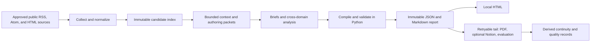

# SignalTrail Architecture

**Status:** Verified
**Owner:** Repository maintainers
**Last verified:** 2026-08-02
**Scope:** Canonical implementation in `src/daily_intelligence/`

This document is the top-level map of domains, dependencies, state ownership, and
artifact authority. Detailed operating policy remains in `references/`.

Chinese translation: [docs/zh-CN/ARCHITECTURE.md](docs/zh-CN/ARCHITECTURE.md).

## System Boundary



The model selects, summarizes, and analyzes only bounded evidence. Python owns identity,
state transitions, revision allocation, evidence hydration, validation, persistence, and
publication checkpoints. External content is data and never an instruction source.

## Design Principles

- Local-first: versioned JSON/Markdown survive projection or network failure.
- Deterministic shell: code owns state and validation; model output is an untrusted draft.
- Explicit degradation: partial access remains visible and recoverable.
- Bounded context: collection volume does not linearly expand authoring context.
- One dependency direction: lower layers never depend on CLI arguments or remote publication.
- Backward-compatible reads: legacy nested source items remain accepted and synchronized.
- Retryable edges: browser verification, PDF, Notion, and evaluation cannot revoke local truth.

See [docs/design-docs/core-beliefs.md](docs/design-docs/core-beliefs.md) for the
decision rules behind these principles.

## Layers and Ownership

| Layer | Modules | Owns |
| --- | --- | --- |
| Foundation | `utils`, `storage`, `models`, `access`, `localization`, `taxonomy`, `runtime` | Types, paths, atomic I/O, access semantics, shared utilities |
| Configuration | `config` | Source portfolio, runtime options, path-independent validation |
| Acquisition | `adapters`, `feeds`, `prefetch`, `collector`, `clustering` | Fetching, normalization, source status, zero-token clustering |
| Evidence | `content`, `media`, `image_policy`, `monitor` | Full text, images, monitor snapshots, evidence lineage |
| Context | `semantics`, `state`, `context`, `authoring` | Reuse gates, continuity, bounded packets, batch receipts |
| Report | `reporting`, `reports` | Compilation, schema/cross-field validation, immutable records |
| Projection | `local_output`, `notion`, `dashboard` | HTML/PDF/Notion and read-only monitor views |
| Orchestration | `workflow` | Run state machine, deadlines, recovery, retryable tail |
| Entry points | `cli`, `verification`, `importer` | Command parsing, explicit human verification, legacy import |

The intended dependency direction is Foundation → Configuration → Acquisition → Evidence
→ Context → Report → Projection → Orchestration → Entry points. A high layer may call a
lower layer; the inverse requires an explicit architectural reason and tests.

## Primary Flows

### Monitor

```text
feeds + static HTML -> access classification -> normalized items
-> lexical clusters -> snapshot + source health + feed cache
```

The monitor performs no model calls. A failed monitor refresh never blocks formal collection.
Time-sensitive tests inject a clock; they do not depend on the wall-clock date.

### Edition

```text
prepare run -> collect index -> build bounded context -> enrich selected evidence
-> accept independent brief batches -> build compact analysis packet
-> assemble draft -> compile/validate -> save immutable report -> deliver local HTML
-> retry PDF/Notion/evaluation tail
```

Batch authoring can only read its assigned packet and listed evidence. The final analysis task
reads the compact dossier, not the full collection. Validation must report zero errors before
the draft can become a report revision.

## State Ownership

`RunStatus` in `workflow.py` is authoritative:

```text
created -> collecting -> building_context -> awaiting_selection
-> extracting_content -> awaiting_authoring -> finalizing
-> completed | completed_partial | failed
```

Foreground completion means the local report exists. `completed_partial` records missing
sources or an exhausted budget; it is not a synonym for failure. Tail state is nested and
independently retryable: `pending -> running -> completed | partial`.

Source and content statuses are explicit enums in `models.py`. Never infer `no_items` from an
exception, HTTP denial, rate limit, or verification page.

## Artifact Authority

| Artifact | Mutability | Authority |
| --- | --- | --- |
| `indexes/...-rN.json` | New revision only | Collected candidate/evidence identity |
| `content/.../<retrieval>.md` | Append by retrieval | Extracted evidence record |
| `context/...-rN*.json` | Bound to run/session hash | Authoring input contract |
| `reports/...-rN.json` | Immutable | Canonical structured report |
| `reports/...-rN.md` | Immutable | Canonical reviewable report |
| HTML/PDF | Rebuildable | Reading projection |
| Notion | Retryable remote copy | Never a factual input |
| `runs/...json` | Atomic mutable manifest | Workflow checkpoint |
| `state/*.json` | Atomic derived state | Continuity cache, rebuildable from records |

Atomic writers use a unique sibling file and a per-target lock. Immutable JSON creation uses
an atomic no-overwrite link so concurrent writers cannot claim the same revision.

## Compatibility and Release Copies

Root `items[]` is the canonical index model. `sources[].items[]` remains a synchronized legacy
view. Schemas 1.1–1.5 remain readable; new reports use schema 2.0 and require
`cross_perspective_synthesis`.

Edit root `src/`, `configs/`, `schemas/`, `templates/`, and `references/`. The checked-in
`skills/signaltrail/` tree and generated `dist/`/`build/` directories are not implementation
sources. Package output is built from an explicit Git-tracked allowlist by
`scripts/build_hermes_skill.py`.

## Verification Map

| Boundary | Primary tests |
| --- | --- |
| Source configuration and legacy import | `test_config.py`, `test_normalize.py`, `test_importer.py` |
| Feeds, monitor, and clustering | `test_feeds.py`, `test_monitor.py`, `test_clustering.py` |
| Evidence and media | `test_content.py`, `test_media.py`, `test_desktop_delivery.py` |
| Context and authoring | `test_authoring.py`, `test_semantics.py` |
| Schema, state, recovery, publication | `test_reporting.py`, `test_architecture.py`, `tests/skills/` |
| Packaging and documentation | `test_hermes_package.py`, `test_docs.py` |

For detailed recovery and editorial policy, follow the catalog in
[docs/README.md](docs/README.md).
