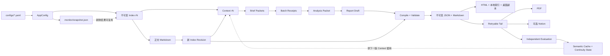
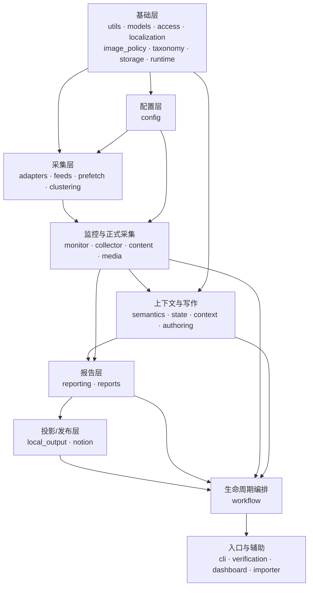

# SignalTrail 项目阅读指南

这份指南面向第一次接触本项目的开发者。建议不要按目录字母顺序逐个读文件，而是先沿一次完整的日报运行建立全貌，再按依赖方向从底层向上深入。

## 先用一句话理解项目

SignalTrail 是一个本地优先的情报日报系统：

1. 从配置的来源采集新闻或研究条目；
2. 把访问结果保存为不可变的 Index；
3. 按需抓取少量正文，生成新的 Index Revision；
4. 把候选内容压缩成有边界的写作 Packet；
5. 由外部 Agent/Hermes 写 Brief 和分析，Python 负责验收、装配和校验；
6. 把报告保存为本地 JSON/Markdown 事实源，再投影成 HTML、PDF 和可选的 Notion 页面。

Python 包本身不直接调用模型供应商 API。模型负责有限的语义写作，确定性的状态转换、校验、版本、文件写入和发布流程都在 Python 中。

## 先分清哪些目录是主代码

| 路径 | 是否优先阅读 | 说明 |
| --- | --- | --- |
| `src/daily_intelligence/` | 是 | 当前 Python 实现的主目录 |
| `tests/` | 是 | 行为契约，理解边界条件时应和源码一起读 |
| `configs/` | 是 | 来源、预算、浏览器、监控、输出和 Notion 配置 |
| `schemas/report.schema.json` | 是 | 报告结构的机器可校验契约 |
| `templates/report-contract.md` | 是 | 模型写作输出契约 |
| `wiki/` | 是 | 当前开发者架构文档 |
| `references/` | 按需 | 运行、安全、编辑、分析和 Notion 细则 |
| `skills/signaltrail/` | 否 | 发布/安装形态的代码镜像；理解实现时以仓库根目录为准 |
| `dist/`、`build/` | 否 | 构建产物 |
| `output/`、`tmp/` | 否 | 示例或临时输出，不是核心实现 |
| `assets/monitor/` | 最后 | 本地监控台的静态前端 |

实现和文档冲突时，按下面的顺序判断：

1. Schema、状态枚举和实际校验代码；
2. 自动化测试；
3. `templates/report-contract.md` 和 `SKILL.md`；
4. `references/` 与 `wiki/`；
5. README、Changelog 和 Release Notes。

## 推荐阅读顺序：第一遍看懂一次完整运行

第一遍只追求回答“系统为什么存在、一次运行经过什么、产生什么文件”，暂时不要深挖每个解析器。

### 第 1 步：先看产品输入和最终输出

依次阅读：

1. [`README.md`](README.md)：能力、安装、主要命令和最终交付物；
2. [`SKILL.md`](SKILL.md)：Hermes/Agent 实际执行日报时遵循的步骤；
3. [`examples/sample_report.json`](examples/sample_report.json)：最终报告对象长什么样；
4. [`examples/reports/`](examples/reports/)：最终 HTML 的阅读体验。

读完应能回答：

- morning 和 evening 是什么；
- 正式日报与零 Token Monitor 有什么区别；
- 为什么 JSON/Markdown 是事实源，HTML/PDF/Notion 只是可重建投影；
- 哪些步骤由 Python 完成，哪些步骤由 Agent 完成。

### 第 2 步：看架构、状态和端到端流程

依次阅读：

1. [`wiki/01-产品目标与边界.md`](wiki/01-产品目标与边界.md)；
2. [`wiki/02-总体架构.md`](wiki/02-总体架构.md)；
3. [`wiki/03-数据与状态模型.md`](wiki/03-数据与状态模型.md)；
4. [`wiki/04-端到端流程.md`](wiki/04-端到端流程.md)。

这一轮重点记住三个互相独立的状态：

- `workflow.RunStatus`：整次日报运行的状态；
- `authoring.AuthoringStatus`：分批写作与分析装配状态；
- `run["tail"]["status"]`：PDF、Notion 和独立评估的尾部状态。

`RunStatus.COMPLETED` 表示本地报告已经交付，不等于 Tail 和 Evaluation 已完成。

### 第 3 步：找到程序入口，但不要先啃 CLI 细节

先看 [`pyproject.toml`](pyproject.toml)：

```toml
[project.scripts]
daily-intel = "daily_intelligence.cli:main"
```

然后在 [`src/daily_intelligence/cli.py`](src/daily_intelligence/cli.py) 中只读两部分：

1. `build_parser()`：系统对外提供哪些子命令；
2. `main()`：每个子命令分发到哪个业务函数。

CLI 只应负责参数解析、配置和依赖注入。真正的生命周期编排集中在 [`workflow.py`](src/daily_intelligence/workflow.py)。

### 第 4 步：沿 `workflow.py` 的公开函数走一遍

按下面顺序阅读公开函数，先忽略以下划线开头的辅助函数：

1. `prepare_edition()`：Monitor 复用/刷新、正式采集、保存 Index、建立 Context；
2. `enrich_edition()`：选择正文、生成新 Index Revision、重建 Context；
3. `begin_authoring()`：创建写作 Session；
4. `accept_authoring_batch()`：验收一个 Brief 批次；
5. `prepare_authoring_analysis()`：合并批次并生成紧凑分析包；
6. `assemble_authoring()`：把分析结果装配成 schema 2.0 草稿；
7. `finalize_edition()`：校验并保存本地事实源和前台 HTML；
8. `complete_edition_tail()`：生成 PDF、可选发布 Notion、调度独立 Evaluation。

读这一遍时，重点跟踪 `run["artifacts"]` 中的路径如何逐步增加，不必立刻理解每个下游函数的实现。

## 核心数据流



这里最重要的边界是：

- Index 只保存采集事实和访问状态，不保存模型推断；
- Packet 是单个模型子任务允许读取的完整边界；
- Report 只有在编译和校验通过后才成为本地事实源；
- Evaluation 不修改已保存的 Report，只影响后续复用和可重建投影；
- 外部网页、Feed、API 响应、图片和模型输出都按不可信数据处理。

## 推荐阅读顺序：第二遍按依赖层深入

第二遍从底层往上读。每读一个模块，紧接着读对应测试；测试通常比长函数更快地说明失败分支和兼容要求。

### 第 5 步：基础类型、状态、路径和配置

建议顺序：

1. [`models.py`](src/daily_intelligence/models.py)：`SourceStatus`、`ContentStatus`、`ArticleItem`、`SourceResult`；
2. [`access.py`](src/daily_intelligence/access.py)：访问失败、挑战页和限流如何分类；
3. [`localization.py`](src/daily_intelligence/localization.py)：输出语言和翻译字段规则；
4. [`taxonomy.py`](src/daily_intelligence/taxonomy.py)：固定栏目、内容分类和兼容别名；
5. [`utils.py`](src/daily_intelligence/utils.py)：URL 规范化、稳定 `item_id`、JSON 读写；
6. [`storage.py`](src/daily_intelligence/storage.py)：Revision、不可变写入、原子写和排它锁；
7. [`runtime.py`](src/daily_intelligence/runtime.py)：唯一数据根绑定和跨根路径拒绝；
8. [`config.py`](src/daily_intelligence/config.py)：类型化配置、资源根定位和参数优先级；
9. [`configs/sources.yaml`](configs/sources.yaml) 与 [`configs/discovery-sources.yaml`](configs/discovery-sources.yaml)。

配套测试：

- `tests/test_config.py`
- `tests/test_normalize.py`

读完应理解：为什么 401/403/429、挑战页或解析错误不能静默变成 `no_items`，以及为什么所有运行 Artifact 必须位于同一个绑定的数据根。

### 第 6 步：采集与零 Token 监控

建议顺序：

1. [`adapters.py`](src/daily_intelligence/adapters.py)：来源模式、专用 Adapter、URL 过滤和 `ArticleItem` 构造；
2. [`feeds.py`](src/daily_intelligence/feeds.py)：RSS/Atom 发现、解析、条件缓存；
3. [`prefetch.py`](src/daily_intelligence/prefetch.py)：静态 HTML 预取和是否需要浏览器回退；
4. [`collector.py`](src/daily_intelligence/collector.py)：正式来源采集、状态合并、Index 写入；
5. [`clustering.py`](src/daily_intelligence/clustering.py)：无模型的跨来源词法聚类；
6. [`monitor.py`](src/daily_intelligence/monitor.py)：Feed/HTML 监控、历史合并、健康状态和 Snapshot；
7. [`dashboard.py`](src/daily_intelligence/dashboard.py) 与 `assets/monitor/`：只读本地监控台。

主调用关系：

```text
feeds ─┐
       ├─> monitor ───────────────┐
prefetch ┘                        │
                                 ├─> collector ─> Index
adapters ─────────────────────────┘
clustering <──── monitor items
dashboard ─────> monitor snapshot
```

配套测试：

- `tests/test_feeds.py`
- `tests/test_prefetch.py`
- `tests/test_monitor.py`
- `tests/test_clustering.py`

注意：Monitor 和正式采集不是同一条流水线。Monitor 可以给正式采集提供新鲜结果，但 Monitor 失败不能阻断核心来源的正式采集。

### 第 7 步：正文与图片

建议顺序：

1. [`image_policy.py`](src/daily_intelligence/image_policy.py)：图片候选清洗和占位图规则；
2. [`content.py`](src/daily_intelligence/content.py)：HTTP 优先正文提取、Edge/Chromium 回退、正文状态和 Index Revision；
3. [`media.py`](src/daily_intelligence/media.py)：公共地址检查、图片下载、缓存、并发、尺寸和像素限制。

配套测试：

- `tests/test_content.py`
- `tests/test_media.py`
- `tests/test_desktop_delivery.py`

这里要区分两种并发：全局并发和同域并发。正文或图片失败必须保留真实状态，并允许整份报告继续降级生成。

### 第 8 步：Context、语义复用和分批写作

建议顺序：

1. [`semantics.py`](src/daily_intelligence/semantics.py)：语义指纹、评估门槛和 Brief 复用；
2. [`state.py`](src/daily_intelligence/state.py)：事件、研判、观察项和预测的连续状态；
3. [`context.py`](src/daily_intelligence/context.py)：历史压缩、候选排序、Brief Plan 和 Packet 生成；
4. [`authoring.py`](src/daily_intelligence/authoring.py)：Session、批次验收、Receipt、指标、分析包和草稿装配；
5. [`templates/report-contract.md`](templates/report-contract.md)：模型必须输出的结构。

主调用关系：

```text
Index + 历史 Report/Evaluation + semantics/state
    -> context.build_context()
    -> Brief Plan + Packets
    -> authoring.begin_authoring_session()
    -> submit_authoring_batch()
    -> immutable Receipts
    -> prepare_analysis_packet()
    -> assemble_report_draft()
```

配套测试：

- `tests/test_authoring.py`
- `tests/test_semantics.py`
- `tests/test_architecture.py` 中包含 `context`、deadline 和降级场景的测试

这部分的关键思想是“有界上下文”：Brief 子任务只读自己的 Packet 及其中列出的正文，分析任务只读紧凑的 Analysis Packet。

### 第 9 步：报告编译、校验与本地投影

建议顺序：

1. [`schemas/report.schema.json`](schemas/report.schema.json)：先看最终结构和必填字段；
2. [`reporting.py`](src/daily_intelligence/reporting.py)：
   - `compile_report_data()` 注入确定性的身份、引用、状态和计数；
   - `normalize_report_data()` 做兼容归一化；
   - `validate_report_data()` 做 Schema、跨字段、Index 证据和语义校验；
3. [`reports.py`](src/daily_intelligence/reports.py)：
   - `save_report()` 分配 Revision、校验、保存 JSON/Markdown 并触发投影；
   - `save_evaluation()` 保存独立评估并更新连续状态；
4. [`local_output.py`](src/daily_intelligence/local_output.py)：HTML、本地历史索引、桌面副本和 PDF；
5. [`notion.py`](src/daily_intelligence/notion.py)：仅在需要远程发布时阅读。

主调用关系：

```text
Report Draft + Index
    -> reporting.compile_report_data()
    -> reporting.normalize_report_data()
    -> reporting.validate_report_data()
    -> reports.save_report()
       -> immutable JSON/Markdown
       -> media.materialize_report_images()
       -> local_output.write_local_outputs()
       -> semantics/state 更新
```

配套测试：

- `tests/test_reporting.py`
- `tests/test_architecture.py`
- `tests/test_desktop_delivery.py`
- `tests/skills/test_daily_intelligence_skill.py` 中的 Notion 断点续传测试

`reporting.py`、`local_output.py` 和 `notion.py` 都很大。先读公开函数和对应测试，再按失败场景进入私有辅助函数，效率最高。

### 第 10 步：恢复、人工验证和兼容入口

最后阅读：

1. [`verification.py`](src/daily_intelligence/verification.py)：人工验证队列、合法点击捕获和新 Index Revision；
2. [`importer.py`](src/daily_intelligence/importer.py)：旧 source-index JSON 导入；
3. [`references/runbook.md`](references/runbook.md)：真实运行的恢复方法；
4. [`wiki/06-可靠性与安全.md`](wiki/06-可靠性与安全.md)：故障、数据根、浏览器和凭证边界。

配套测试：

- `tests/test_importer.py`
- `tests/test_architecture.py` 中的 verification、resume、tail 和 partial 测试

旧 Index 可能包含根级 `items[]`、嵌套 `sources[].items[]`，或同时包含两者。根级 `items[]` 是当前规范结构，嵌套结构必须继续兼容；正文更新后由 `synchronize_nested_items()` 同步。

### 第 11 步：构建、安装和 CI

功能代码看懂后再读：

1. [`scripts/build_hermes_skill.py`](scripts/build_hermes_skill.py)：从 Git 跟踪文件白名单构建 `dist/signaltrail`；
2. `scripts/install.ps1` 和 `scripts/install.sh`：安装到 Hermes Skill 目录；
3. [`tests/test_hermes_package.py`](tests/test_hermes_package.py)：发布包完整性和秘密扫描；
4. [`.github/workflows/ci.yml`](.github/workflows/ci.yml)：Windows/Ubuntu、Python 3.11/3.12 的 CI。

## 模块依赖关系总览

下面是主依赖方向，不表示每条细小 import：



几个值得单独记住的实际依赖：

- `context.py` 会调用 `reporting.evaluation_continuity_floor()`，因为历史报告能否复用受评估结果约束；
- `reports.py` 依赖 `media.py`、`local_output.py`、`semantics.py` 和 `state.py`，它是“保存事实源并更新本地投影/连续性”的汇合点；
- `notion.py` 依赖 `reports.py` 和 `local_output.py`，远程发布消费本地报告，不能反向成为事实输入；
- `verification.py` 会调用 `workflow.adopt_index_for_run()`，人工验证生成的新 Index Revision 可以被未完成 Run 采用；
- `cli.py` 位于最上层；底层模块不应导入 `cli.py` 或依赖命令行参数对象。

## 外部 Python 依赖如何对应代码

| 依赖 | 主要使用位置 | 作用 |
| --- | --- | --- |
| `httpx` | `feeds.py`、`prefetch.py`、`monitor.py`、`content.py`、`media.py`、`notion.py` | Feed、HTML、正文、图片和 Notion HTTP |
| `beautifulsoup4` | `feeds.py`、`prefetch.py`、`content.py` | HTML/Feed 发现和正文清理 |
| `playwright` | `collector.py`、`content.py`、`verification.py`、`cli.py` | 浏览器采集、正文回退和人工验证 |
| `jsonschema` | `reporting.py` | Draft 2020-12 报告校验 |
| `Pillow` | `media.py` | 图片格式、尺寸、像素和纯色检查 |
| `PyYAML` | `config.py`、`notion.py`、构建脚本 | 配置和发布映射 |
| `python-dotenv` | `cli.py` | 读取 `<HERMES_HOME>/.env` |
| `reportlab` | `local_output.py` | PDF 降级生成 |
| `tzdata` | Python 时区运行时 | Windows/精简环境中的 IANA 时区 |
| `pytest`、`ruff`、`pypdf` | 测试和 CI | 回归测试、静态检查和 PDF 验证 |

系统级依赖包括 Hermes Agent/Gateway、Edge 或 Playwright Chromium；Notion 只在显式发布时需要。

## 修改代码时如何快速定位

| 想修改的能力 | 先读 | 再读测试 |
| --- | --- | --- |
| 新来源或 URL 过滤 | `configs/*.yaml`、`config.py`、`adapters.py` | `test_config.py`、`test_normalize.py` |
| Feed/Monitor | `feeds.py`、`monitor.py`、`clustering.py` | `test_feeds.py`、`test_monitor.py`、`test_clustering.py` |
| 正文提取 | `content.py`、`access.py` | `test_content.py`、`test_architecture.py` |
| 图片 | `image_policy.py`、`media.py` | `test_media.py`、`test_desktop_delivery.py` |
| Context 或批次写作 | `context.py`、`authoring.py` | `test_authoring.py`、`test_architecture.py` |
| 报告字段或校验 | Schema、`reporting.py`、`reports.py` | `test_reporting.py`、`test_architecture.py` |
| HTML/PDF | `local_output.py` | `test_desktop_delivery.py` |
| Notion | `notion.py`、`configs/notion.yaml` | `test_architecture.py`、`tests/skills/` |
| 状态或恢复 | `workflow.py`、`storage.py`、`runtime.py` | `test_architecture.py`、`test_config.py` |
| 发布包 | 构建脚本、安装脚本、`SKILL.md` | `test_hermes_package.py` |

项目约束要求：任何来源过滤、状态模型、校验或发布逻辑的变化都必须增加或更新测试。

## 建议的本地验证顺序

只读代码不需要真实浏览器、真实 Notion 或生产数据。完成局部理解或修改后，可以按风险从小到大运行：

```powershell
python -m pytest tests/test_config.py tests/test_normalize.py -q
python -m pytest tests/test_authoring.py tests/test_reporting.py -q
python -m pytest
python -m ruff check .
python -m compileall -q src tests scripts
git diff --check
```

测试不应读取真实运行时 `data/`、用户浏览器 Profile、Cookie、认证 HTML 或真实 Notion Token。

## 最后用这几个问题自测

如果能回答下面的问题，就已经掌握了项目主干：

1. `daily-intel` 从哪里进入，为什么业务逻辑不放在 CLI 中？
2. Monitor Snapshot 与正式 Index 有什么区别？
3. 为什么正文富化会创建新的 Index Revision？
4. Context、Brief Packet、Receipt、Analysis Packet 和 Report Draft 分别是谁生产、谁消费？
5. Agent 输出为什么不能直接保存成正式报告？
6. `completed`、`completed_partial`、`tail.partial` 和 `failed` 有什么区别？
7. 为什么 JSON/Markdown 是事实源，而 HTML/PDF/Notion 不是？
8. Evaluation 为什么不能回写并改变已发布 Report 的内容 Hash？
9. 为什么访问失败不能转换为 `no_items`？
10. 为什么 `skills/signaltrail/`、`dist/` 和运行时 `data/` 不应作为日常实现的阅读入口？

回答不清楚时，优先回到 `workflow.py`、`wiki/03-数据与状态模型.md` 和对应测试，而不是从头重读所有文件。
