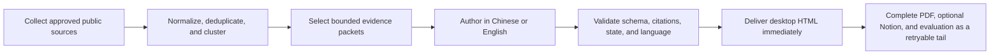

# SignalTrail

[简体中文](README.md) | [English](README.en.md)

> Signals distilled. Sources intact.

SignalTrail is a local-first [Hermes Agent](https://hermes-agent.nousresearch.com/)
skill for repeatable editorial reporting. It collects approved public sources,
clusters duplicate coverage, and helps Hermes produce a Chinese or English briefing
with visible evidence, explicit source health, and continuity across editions. It
turns scattered signals into a reviewable decision trail that teams can brief,
archive, and revisit.

[Report gallery](#report-gallery) · [Quick start](#quick-start) ·
[Engineering records](docs/README.md) ·
[Hermes skill](SKILL.md)

[](https://hermes-agent.nousresearch.com/)
[](LICENSE)


## What the product delivers

SignalTrail turns a large daily reading queue into a consistent decision artifact:

- **Reader-ready morning and evening reports** in HTML and PDF, with Markdown and
  JSON retained as durable local records.
- **Traceable coverage** that preserves the original title, source, link, publication
  time, and any access limitation instead of presenting an opaque summary.
- **A seven-section editorial view** spanning international, domestic, military,
  markets, technology, research papers, and open-source projects.
- **Three analytical lenses plus synthesis** for geopolitics, AI/technology, and
  markets, including shared signals, disagreements, and what to watch next.
- **A zero-model-token local monitor** for feed refresh, caching, deduplication,
  clustering, and source-health review. Model work begins only for report selection,
  target-language writing, and analysis.
- **Local ownership by default** with versioned files, a portable desktop HTML copy,
  and optional Notion delivery.

The bundled configuration separates 32 core reporting sources from 51 discovery
sources. Every formal source has `report_target: 15` and `report_max: 15`: when at
least fifteen candidates exist, the report uses the first fifteen in the current
index order; otherwise it uses the candidates actually available. Discovery sources
keep both values at zero, broadening the signal surface without silently expanding
the editorial or model budget.

A full run can require up to 480 ordinary briefs. SignalTrail limits authoring to
the planned Top-15 gaps, splits them into at most 12 bounded packets, and processes
those packets in waves of three under Hermes' default concurrency. The default full
run budget is therefore 60 minutes; start earlier when delivery must land exactly at
06:00 or 18:00.

## Report gallery

The archived editions below show the reading experience at operating scale: hundreds
of collected updates compressed into ten reviewable events with source links and
multi-domain analysis.

| Edition | Coverage processed | Editorial result | Decision themes |
| --- | ---: | ---: | --- |
| [2026-07-24 morning r3](https://github.com/Merak-Wang/signaltrail-skill/blob/main/examples/reports/2026-07-24-morning-r3.html) | 24 sources · 197 updates | 10 priority events | Energy, tariffs, and AI capital efficiency |
| [2026-07-25 morning r1](https://github.com/Merak-Wang/signaltrail-skill/blob/main/examples/reports/2026-07-25-morning-r1.html) | 29 sources · 235 updates | 10 priority events | Energy corridors, technology regulation, and agent engineering |

These are preserved schema 1.5 editions and retain the earlier **Daily Intelligence**
masthead. Current schema 2.0 reports add a required cross-perspective synthesis and
use the **SignalTrail** brand. GitHub may display the HTML source; download the file
and open it locally for the full report experience.

Fixture data and gallery notes are documented in
[examples/README.en.md](https://github.com/Merak-Wang/signaltrail-skill/blob/main/examples/README.en.md).

## Product fit

SignalTrail is designed for individual researchers and small teams that already use
Hermes and want a repeatable report they can inspect, archive, and modify locally.
It is especially useful when “why this item is here” and “what failed to load” matter
as much as the summary.

It is not an enterprise intelligence platform. It does not include paid research,
social-firehose coverage, mobile clients, SSO, RBAC, or an SLA. It also does not
bypass login, CAPTCHA, paywalls, rate limits, or other access controls.

| Need | SignalTrail approach |
| --- | --- |
| Daily executive readout | Fixed morning/evening structure with concise editorial selection |
| Evidence review | Original source identity, title, URL, time, and status remain visible |
| Ongoing situational awareness | Local monitor, story clusters, source health, and verification queue |
| Bilingual delivery | One selected output language across content, interface, PDF, and Markdown |
| Durable ownership | Local JSON/Markdown source of truth; rebuildable HTML/PDF projections |
| Remote handoff | Optional Notion metadata page with a portable HTML attachment |

## Quick start

### Requirements

- Git and Python 3.11 or newer
- A configured [Hermes Agent](https://hermes-agent.nousresearch.com/) and Hermes
  Gateway
- Microsoft Edge on Windows; the installer provisions Playwright Chromium on macOS
  and Linux

### Install from GitHub

Windows:

```powershell
git clone https://github.com/Merak-Wang/signaltrail-skill.git
cd signaltrail-skill
powershell -NoProfile -ExecutionPolicy Bypass -File .\scripts\install.ps1
```

macOS or Linux:

```bash
git clone https://github.com/Merak-Wang/signaltrail-skill.git
cd signaltrail-skill
bash ./scripts/install.sh
```

On a new Ubuntu or Debian machine, install the Chromium system libraries after the
script completes:

```bash
python -m playwright install-deps chromium
```

The installer synchronizes the skill to `skills/research/signaltrail` and installs
the backward-compatible `daily-intel` command:

```text
daily-intel --help
```

Upgrading does not rename or split the established
`$HERMES_HOME/daily-intelligence` data root. Resource discovery also accepts the
legacy `skills/research/merak-brief` and `skills/research/daily-intelligence`
locations. After confirming the new `/signaltrail` skill works, remove the old
skill directories if Hermes shows legacy brand entries.

### Ask Hermes for the first report

```text
Use SignalTrail to create today's Chinese morning report as local HTML and PDF.
```

Or:

```text
Use SignalTrail to create an English evening brief, highlight what changed today,
and add tomorrow's watch signals.
```

The default output language is `zh-CN`. Select English per run:

```text
daily-intel run-edition --edition morning --language en
```

Or set the long-term choice in `configs/sources.yaml`:

```yaml
output:
  language: zh-CN  # zh-CN or en
```

The selected language controls summaries, analysis, labels, HTML, PDF, and Markdown.
Original headlines remain unchanged; a translated title is added only when needed.

## How it works



Collection failures do not stop healthy sources. A failed, rate-limited, or
verification-pending source keeps that status and its recovery path; it is never
silently converted to `no_items`. If the index contains candidates but brief
authoring or validation did not finish, the report names every affected source and
its validated/planned count even when sibling sources in that section succeeded; it
must not describe those candidates as uncollected or let the source vanish silently.

## Local intelligence desk

Refresh and inspect the monitor:

```text
daily-intel refresh-monitor
daily-intel monitor-status
```

Open the localhost desk and refresh while the process is running:

```text
daily-intel serve --open --refresh-minutes 30
```

The desk listens on `127.0.0.1` by default. Installation does not register a system
service; unattended refresh requires the process to remain running or an
OS-level scheduled task.

Edit the source portfolio directly:

- Core report sources: [configs/sources.yaml](configs/sources.yaml)
- Discovery sources: [configs/discovery-sources.yaml](configs/discovery-sources.yaml)

All sources share `collection.item_order`. The default `source` mode gives a formal
source its original page, ranking, or feed Top1–15. In `published_at` mode, the
formal report takes the first fifteen from the current index after valid publication
times are sorted newest first; missing and tied times retain stable input order. A
source-level `item_order` can override the global value. Both modes preserve the
original `source_rank`, and ordinary briefs are not reordered by `importance`.
Hugging Face Papers uses the Trending list, so `source` mode follows its current Top
ranking even when it contains papers published in earlier years.

## Output contract

| Artifact | Role |
| --- | --- |
| `reports/YYYY-MM-DD/EDITION-rN.json` | Versioned structured record; existing revisions are never overwritten |
| `reports/YYYY-MM-DD/EDITION-rN.md` | Reviewable and diff-friendly archive |
| `reports/YYYY-MM-DD/EDITION-rN.html` | Full local reading edition |
| `reports/YYYY-MM-DD/EDITION-rN.pdf` | Print/share edition with validated images embedded |
| `reports/index.html` | Local archive by date and revision |
| `Desktop/daily-intelligence-…html` | Portable single-file reading copy with images embedded |
| Notion | Optional metadata page plus portable HTML attachment |

By default, report history lives under
`%LOCALAPPDATA%\hermes\daily-intelligence\reports` on Windows or
`~/.hermes/daily-intelligence/reports` on macOS and Linux. When `HERMES_HOME` is set,
the same `daily-intelligence/reports` path is created beneath it.

Notion is optional. Without Notion credentials, every local artifact remains
available. If desktop delivery, PDF rendering, or Notion delivery fails, the
versioned local record remains intact and the failed projection can be retried.

## Hermes community package

`SKILL.md` follows the Hermes/Agent Skills layout: public metadata is at the
frontmatter root, Hermes discovery/configuration lives under `metadata.hermes`, and
procedural detail is progressively disclosed through `references/`, `templates/`,
and deterministic scripts.

Build the publication directory from an allowlist of Git-tracked files:

```text
python scripts/build_hermes_skill.py
```

The command validates metadata, directory naming, required runtime files, forbidden
runtime paths, file sizes, and common secret patterns, then writes
`dist/signaltrail`. Publish that directory—not the repository root:

```text
hermes skills publish ABSOLUTE_PATH/dist/signaltrail --to github --repo OWNER/REPOSITORY
```

The absolute path avoids ambiguity with the Hermes local skill root. Review
`git status`, the generated file list, and the Hermes security scan before opening
the community pull request.

## Documentation

- Repository map: [AGENTS.md](AGENTS.md)
- Architecture: [ARCHITECTURE.md](ARCHITECTURE.md)
- Engineering record catalog: [docs/README.md](docs/README.md)
- Skill procedure: [SKILL.md](SKILL.md)
- Operations and recovery: [references/runbook.md](references/runbook.md)
- Editorial and evidence policy:
  [references/editorial-policy.md](references/editorial-policy.md)
- Detailed architecture and state model:
  [references/system-design.md](references/system-design.md)
- Windows setup: [references/windows-setup.md](references/windows-setup.md)
- Notion setup: [references/notion-setup.md](references/notion-setup.md)
- Current quality score: [docs/quality-score.md](docs/quality-score.md)
- Release history: [CHANGELOG.md](CHANGELOG.md)

## Development

```text
python -m pip install -e ".[dev]"
python -m ruff check .
python -m pytest
python -m compileall -q src tests scripts
python scripts/check_code_comments.py
python scripts/check_docs.py
```

Update tests for any source filter, status model, validation, or publishing change.
Never commit runtime `data/`, browser profiles, cookies, account screenshots,
authenticated HTML, or secrets.

## License

[MIT](LICENSE) © Wang Mingfeng
