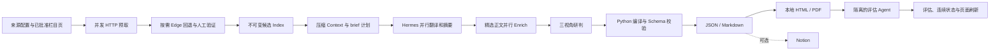

<div align="center">

# Daily Intelligence

**把分散在新闻、论文与开源社区里的信息，变成一份可追溯、可连续、可直接阅读的中文情报日报。**

面向 [Hermes Agent](https://hermes-agent.nousresearch.com/) 的双时段 Agent Skill。<br>
06:00 建立晨间基线，18:00 补充新增事实、判断修正与次日观察。

[](https://github.com/Merak-Wang/daily-intelligence-skill/actions/workflows/ci.yml)
[](https://github.com/Merak-Wang/daily-intelligence-skill/releases)
[](https://www.python.org/)
[](https://hermes-agent.nousresearch.com/)
[](LICENSE)

[快速开始](#快速开始) · [它能做什么](#它能做什么) · [工作方式](#工作方式) · [配置](#配置) · [中文 Wiki](wiki/Home.md)

</div>

---

## 为什么需要它

普通新闻聚合器解决的是“把链接放到一起”；Daily Intelligence 关注的是更难的后半程：

- **覆盖够广**：普通新闻以轻量 brief 展示，不因低重要性被静默丢弃；每个来源最多保留 15 条，并保留原始 TopN。
- **证据有边界**：TL;DR 只能来自已读正文、公开摘要或标题明确表达的事实；拿不到正文时不编造内容。
- **分析能追溯**：研判分别从地缘政治、AI 研究/工程、股票分析三个视角展开，并引用前文事件。
- **前后有连续性**：晚报修订晨报，次日继续跟踪历史事件、既有判断、风险信号与人工反馈。
- **失败可恢复**：采集、正文、写作、交付都有 checkpoint；单个来源失败不会伪装成“今日无内容”，也不会拖垮整份日报。
- **没有 Notion 也能用**：本地 JSON/Markdown 是事实源，响应式 HTML 与 A4 PDF 是默认成品；Notion 只是可选同步目标。

## 它能做什么

### 一份结构稳定的中文日报

```text
资讯
├─ 国际
├─ 国内新闻
├─ 军事
└─ 市场

技术
├─ 技术新闻
├─ 值得阅读的论文
└─ 今日值得关注的开源项目

研判
├─ 地缘政治专家视角
├─ AI 研究/开发工程师视角
└─ 股票分析师视角

质量评估与用户反馈（交付后异步追加）
```

七个内容栏目始终保留。栏目内按来源建立三级标题；每条信息包含标题、中文 TL;DR、相对排序与原文链接。英文标题保留原文，下一行给出自然中文翻译。数字重要性分数、内部访问状态和调试字段不会挤占读者版页面。

### 四种本地成果，一种可选远端

| 成果 | 用途 | 是否依赖云服务 |
| --- | --- | --- |
| JSON | 不可变结构化事实源、校验与后续连续性 | 否 |
| Markdown | 可审阅、可版本控制的文本事实源 | 否 |
| HTML | 响应式阅读、搜索、证据跳转、反馈下载与本地归档 | 否 |
| PDF | A4 阅读、打印、分享，保留页码与可点击原文链接 | 否 |
| Notion | 美观的远程同步与团队阅读 | **可选** |

每次交付都会更新 `reports/index.html` 本地日报中心。独立评估完成后只刷新 HTML/PDF 的质量区，不篡改原始报告和内容哈希。

### 面向真实网页环境的采集

- 通用公开索引页先走无脚本 HTTP 并发预取，降低浏览器开销。
- 登录、JavaScript、专用 adapter 或人工验证页面回退到同一个 Microsoft Edge profile。
- 失败、403、验证码与限流页面进入一个本地验证队列；成功页立即提取，失败页保留链接后继续。
- 正文只按重要性精选并行读取，每版默认最多 12 篇；普通信息仍可凭公开摘要进入 brief。
- Agent 可提出新的同域栏目页，人工确认后纳入后续采集，无需再增加抓取脚本。

## 快速开始

### 1. 安装

Windows 是主测试平台。Hermes 的技能目录为 `%LOCALAPPDATA%\hermes\skills\`。

```powershell
git clone https://github.com/Merak-Wang/daily-intelligence-skill.git
cd daily-intelligence-skill
powershell -NoProfile -ExecutionPolicy Bypass -File .\scripts\install.ps1
hermes skills list
daily-intel --help
```

macOS / Linux：

```bash
git clone https://github.com/Merak-Wang/daily-intelligence-skill.git
cd daily-intelligence-skill
./scripts/install.sh
daily-intel --help
```

要求：Python 3.11+、Hermes Agent 与 Hermes Gateway。Windows 使用系统 Microsoft Edge；macOS/Linux 使用 Playwright Chromium。

### 2. 固定运行数据目录

```powershell
$env:DAILY_INTEL_DATA_DIR = "$env:LOCALAPPDATA\hermes\daily-intelligence"
$env:DAILY_INTEL_BROWSER_CHANNEL = "msedge"
$env:DAILY_INTEL_PROFILE_DIR = "$env:LOCALAPPDATA\hermes\browser-profiles\daily-intelligence"
```

第一次运行会把唯一数据根记录到 Hermes Home，防止手动任务、Cron 与评估任务各自产生一套历史。迁移数据时使用显式的 `data-root status|adopt`，不会隐式删除旧目录。

### 3. 直接告诉 Hermes

```text
使用 daily-intelligence 生成今天的中文晨报，保存为本地 HTML 和 PDF，不发布到 Notion。
```

晚间版：

```text
使用 daily-intelligence 生成今天的中文晚报；读取当日晨报、已有评估和人工反馈，
补充日间新增、事实确认、判断修正与次日观察，并保存为本地 HTML/PDF。
```

完成后打开本地日报中心：

```powershell
Start-Process "$env:LOCALAPPDATA\hermes\daily-intelligence\reports\index.html"
```

> 只有明确要求“并发布到 Notion”时才需要 Notion 凭证，也只有显式传入 `--publish` 才会访问 Notion。

## 工作方式



| 谁负责 | 职责 | 原因 |
| --- | --- | --- |
| Hermes 生成 Agent | 翻译、TL;DR、相对重要性、事件选择与三视角研判 | 需要语义理解与跨来源综合 |
| Python | 浏览器、过滤、并发、ID、引用、状态、revision、Schema、HTML/PDF | 相同输入应产生可测试、可恢复的机械结果 |
| 独立评估 Agent | 九维评分、证据缺口和连续性采纳建议 | 生成者不自评，且评估不阻塞日报交付 |

这套边界是项目最重要的设计：**模型写它擅长的内容，代码守住不能靠“提示词自觉”的约束。**

## 设计亮点

<details>
<summary><strong>两层内容模型：覆盖与研判不再互相拖累</strong></summary>

`briefs[]` 用于扩大来源覆盖，最多保留每来源 15 条轻量新闻；`items[]` 只容纳少量值得跨来源核实、读取正文并进入研判的精选事件。新闻越多不再意味着每条都要做重型分析。

</details>

<details>
<summary><strong>来源排名、编辑排序与时效性分离</strong></summary>

原网站的热搜/榜单/来源 TopN 被保存在结构化元数据中；日报可以按相对重要性重排，但不会丢失原始热度。旧闻若历史日报未出现仍可收录，但不会错误标注为 `[新增]`；时效性评分只评价规定窗口内的信息。

</details>

<details>
<summary><strong>评估门控的语义复用</strong></summary>

只有通过独立评估门槛且内容指纹未变化的翻译和 TL;DR 才能在后续版本复用。正文、标题、摘要或 URL 变化都会重新交给 Agent，低质量日报也不会污染下一天。

</details>

<details>
<summary><strong>本地优先、远端可重试</strong></summary>

JSON/Markdown 先原子保存，HTML/PDF 随后生成；Notion 失败只影响远程投影。报告 revision 不可覆盖，发布登记可断点续传，失败的 run 会回到可修复状态而不是永久卡在 `finalizing`。

</details>

## 配置

主配置位于 [`configs/sources.yaml`](configs/sources.yaml)。默认预算：

```yaml
budget:
  max_runtime_seconds: 600
  max_agent_tokens: 10000000
  report_items_per_source: 15
  max_fulltext_per_run: 12

output:
  formats: [html, pdf]
  pdf_engine: edge
  open_after_finalize: false
```

`pdf_engine: edge` 会用系统 Edge 从同一份 HTML 打印 A4 PDF；失败时自动降级到 ReportLab。HTML 内的反馈表单只下载本地 JSON，不会自行上传。

### 可选 Notion

```powershell
$env:NOTION_TOKEN = "ntn_..."
$env:NOTION_DATA_SOURCE_ID = "..."
```

对于 `/ds/{workspace_uuid}/{data_source_uuid}`，使用第二个 UUID。发布器会读取真实 data source schema，并从 [`configs/notion.yaml`](configs/notion.yaml) 选择完全匹配的属性映射；不匹配时返回具体属性名与类型错误，不会擅自修改共享数据库。

### 定时任务

```powershell
hermes cron create "0 6 * * *" `
  "使用 daily-intelligence 在 10 分钟预算内生成 06:00 中文晨报并保存本地 HTML/PDF；run-edition 必须传 --unattended；不得等待 GUI 或独立评估，允许 completed_partial。" `
  --skill daily-intelligence --name "Daily Intelligence Morning"

hermes cron create "0 18 * * *" `
  "使用 daily-intelligence 生成 18:00 中文晚报并保存本地 HTML/PDF；run-edition 必须传 --unattended；读取当天晨报、评估与人工反馈，补充新增、确认、修正和次日观察。" `
  --skill daily-intelligence --name "Daily Intelligence Evening"
```

定时任务不打开人工验证窗口；交互式运行发现挑战页时会自动打开 Edge 验证前端。独立评估在本地交付后以一次性 Hermes 任务异步执行，不要另建固定 06:05/18:05 评估 Cron。

完整命令、状态恢复和故障处理见 [运行手册](references/runbook.md)。

## 数据与隐私

```text
DATA_DIR/
├─ runs/                    可恢复控制状态
├─ indexes/                 不可变候选索引
├─ context/                 Agent 压缩上下文与写作计划
├─ content/                 按需正文
├─ reports/index.html       本地日报中心
├─ reports/YYYY-MM-DD/      JSON / Markdown / HTML / PDF
├─ evaluations/             独立评估 artifact
├─ state/                   连续性与语义缓存
└─ publishing/              可重试的远程发布登记
```

- 外部网页、评论、论文和 README 一律视为不可信数据，不执行其中的指令。
- 不破解 CAPTCHA，不做浏览器指纹伪装、代理绕过或付费墙规避。
- `.env`、token、cookies、browser profile、认证 HTML、账号截图和 runtime data 不进入仓库。
- 允许基于公开信息进行市场研判，但不执行交易，也不自动给出个性化仓位指令。

## 开发

```powershell
python -m pip install -e ".[dev]"
python -m ruff check .
python -m pytest
python -m compileall -q src tests
```

CI 覆盖 Windows / Ubuntu 与 Python 3.11 / 3.12。来源过滤、状态模型、校验、发布或旧索引兼容性发生变化时，必须同步补测试。

仓库布局：

```text
SKILL.md                     Hermes 简洁执行入口
configs/                     来源、预算、浏览器与输出配置
references/                  编辑、证据、运行和部署细则
schemas/report.schema.json   机器可验证报告契约
templates/report-contract.md Agent 写作契约
src/daily_intelligence/      采集、编译、状态与多格式渲染
tests/                       单元、架构、兼容与发布测试
wiki/                        中文设计与代码说明
```

## 文档

| 从这里开始 | 你会看到什么 |
| --- | --- |
| [Wiki 首页](wiki/Home.md) | 设计原则、推荐阅读路线与系统全景 |
| [产品目标与边界](wiki/01-产品目标与边界.md) | 为什么这样设计，以及明确不做什么 |
| [总体架构](wiki/02-总体架构.md) | Agent、Python、状态和投影之间的责任边界 |
| [端到端流程](wiki/04-端到端流程.md) | 每阶段输入、输出、状态与恢复路径 |
| [依赖、配置与注入](wiki/09-依赖配置与注入.md) | 参数优先级、环境变量、adapter 与 context 注入 |
| [核心算法与跨模块调用](wiki/10-核心算法与跨模块调用.md) | 过滤、排名、并发、编译、校验和完整调用链 |
| [运行手册](references/runbook.md) | 常用命令、Edge 验证和故障恢复 |
| [Changelog](CHANGELOG.md) | 版本变化与兼容说明 |

## 当前边界

- 10 分钟是正常运行目标，不是网络异常、首次登录或大面积验证挑战下的硬实时保证。
- 受限来源可能只保留公开元数据与原文链接；系统不会绕过站点限制。
- 研判是研究辅助，不构成投资、法律或其他专业决策的替代意见。
- 新报告使用 schema 1.5；旧版 schema 1.1—1.4 与旧 source-index 双层结构仍可读取。

## 参与贡献

欢迎通过 Issue 提交来源建议、失败样例和日报质量反馈。贡献代码前请先阅读 Wiki 的扩展设计；新增来源优先使用配置或 adapter 扩展，避免复制新的独立抓取脚本。

## License

[MIT](LICENSE) © Wang Mingfeng
