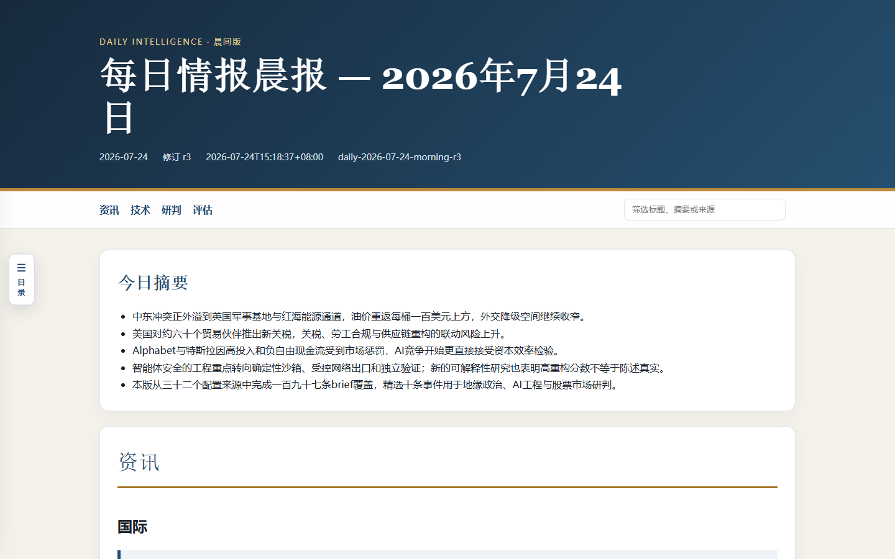

# Daily Intelligence

> 把分散在新闻、论文和开源社区里的重要更新，整理成一份可以核对原文的中文晨报或晚报。

Daily Intelligence 是运行在 [Hermes Agent](https://hermes-agent.nousresearch.com/) 中的本地日报 Skill。它从预设的公开来源收集更新、合并重复事件，再由 Hermes 编写中文摘要和重点分析。完成后的 HTML 会自动复制到桌面，也可以同时保存为 PDF、Markdown 和 JSON。

[查看历史实报](examples/reports/2026-07-24-morning-r3.html) · [快速安装](#快速开始) · [阅读项目 Wiki](wiki/Home.md)

[](https://hermes-agent.nousresearch.com/)
[](LICENSE)

## 历史实报示例

下面两份 HTML 来自实际运行，没有为 README 重新润色。GitHub 不直接显示 HTML 时，请下载后用浏览器打开。

[](examples/reports/2026-07-24-morning-r3.html)

<sub>2026 年 7 月 24 日历史晨报首屏。点击图片查看完整 HTML；该报告使用 schema 1.5。</sub>

| 日期 | 报告 | 当次处理结果 | 重点内容 |
| --- | --- | --- | --- |
| 2026-07-24 | [晨报 r3](examples/reports/2026-07-24-morning-r3.html) | 24 个来源、197 条更新，选出 10 个重点事件 | 能源、关税与 AI 资本效率 |
| 2026-07-25 | [晨报 r1](examples/reports/2026-07-25-morning-r1.html) | 29 个来源、235 条更新，选出 10 个重点事件 | 能源通道风险、科技监管与智能体工程 |

这两份是历史格式报告（schema 1.5）。当前代码使用 schema 2.0，并要求增加跨视角综合；旧文件保留不动，便于比较真实输出和后续版本变化。

## 每次生成，你会得到什么

- **一份可直接阅读的日报**：HTML 自动复制到桌面，可同时生成 PDF；每条更新保留来源、原题和链接，优先显示发布时间，来源未提供时明确标注采集时间。
- **先看全貌，再读重点**：日报按国际、国内、军事、市场、技术、论文和开源项目整理更新，再从中选择最多 12 个重要事件深入分析。
- **三个观察角度**：当前格式分别说明事件对地缘政治、AI 研究与工程、股票市场的影响，并汇总三种视角的共识、分歧和后续观察信号。
- **一个本地情报台**：可以浏览最新信息、查看同一事件的聚合结果，并检查哪些来源正常、失败或需要人工确认。

新闻流刷新不调用大模型；生成正式晨报或晚报时，Hermes 模型才参与筛选、中文写作和分析。

## 它和其他情报工具有什么不同

Daily Intelligence 不以来源规模、付费内容或企业协作功能取胜。它解决的是更窄的问题：**让 Hermes 用户在自己的电脑上，生成一份结构固定的中文成品日报。**

| | Daily Intelligence | [Feedly](https://feedly.com/) / [Inoreader](https://www.inoreader.com/) | [AlphaSense](https://www.alpha-sense.com/) / [Meltwater](https://www.meltwater.com/) |
| --- | --- | --- | --- |
| 主要用途 | 生成固定结构的中文晨报和晚报 | 持续订阅、筛选、阅读和自动分发信息流 | 企业研究、媒体监测和决策工作流 |
| 来源 | 83 个可编辑的公开来源，其中 32 个用于正式日报 | 大规模托管来源和用户订阅 | 付费研究、金融文档、新闻或社交数据库 |
| 交付方式 | 本地 HTML、PDF、Markdown、JSON；可选 Notion | Web、移动端、邮件、团队空间和 API | 企业工作台、告警、报告及办公套件集成 |
| 强项 | 本地文件、固定中文成品、来源和流程可改；未读取的网站会注明原因 | 来源广度、个性化、移动端和协作 | 专有内容、企业治理和成熟行业工作流 |
| 明显限制 | 依赖 Hermes；没有付费内容库、移动端、SSO、RBAC 或 SLA | 以托管服务为主，不是本地可修改的日报流水线 | 不是轻量的个人本地工具 |

Feedly 和 Inoreader 也提供 AI 摘要、报告和自动分发。如果你更重视灵活订阅、移动端或团队协作，它们更完整；Daily Intelligence 的差别是本地可修改，并按固定中文结构生成文件。

适合已经使用 Hermes，希望用同一套结构生成中文日报，并把报告留在自己电脑上的个人研究者或小团队。

如果你需要券商研报、专家访谈、全网社交媒体监听、企业权限管理或服务等级承诺，这个项目不能替代专门的企业情报平台。

## 快速开始

### 1. 准备环境

- Git 与 Python 3.11 或更高版本；
- 已安装并配置 [Hermes Agent](https://hermes-agent.nousresearch.com/) 与 Hermes Gateway；
- Windows 使用系统自带的 Microsoft Edge；macOS 和 Linux 的安装脚本会安装 Playwright Chromium。

### 2. 安装

Windows：

```powershell
git clone https://github.com/Merak-Wang/daily-intelligence-skill.git
cd daily-intelligence-skill
powershell -NoProfile -ExecutionPolicy Bypass -File .\scripts\install.ps1
```

macOS / Linux：

```bash
git clone https://github.com/Merak-Wang/daily-intelligence-skill.git
cd daily-intelligence-skill
bash ./scripts/install.sh
```

全新安装的 Ubuntu/Debian 还需要 Chromium 的系统依赖。安装脚本结束后，请再执行一次：

```bash
python -m playwright install-deps chromium
```

其他 Linux 发行版请按照 [Playwright 浏览器依赖说明](https://playwright.dev/python/docs/browsers#install-system-dependencies) 安装 Chromium 所需库。

安装脚本会把 Skill 同步到 Hermes 的 `skills/research/daily-intelligence` 目录，并安装 `daily-intel` 命令。用下面的命令确认安装成功：

```powershell
daily-intel --help
```

### 3. 生成第一份日报

在 Hermes 中发送：

```text
使用 daily-intelligence 生成今天的晨报，并保存为本地 HTML 和 PDF。
```

或者：

```text
使用 daily-intelligence 生成今天的晚报，补充日间变化和次日观察。
```

默认情况下，Windows 把版本化报告保存在 `%LOCALAPPDATA%\hermes\daily-intelligence\reports\`，macOS 和 Linux 保存在 `~/.hermes/daily-intelligence/reports/`。如果设置了 `HERMES_HOME`，则改用 `$HERMES_HOME/daily-intelligence/reports/`。最新 HTML 默认复制到 `%USERPROFILE%\Desktop` 或 `~/Desktop`，也可以通过 `output.desktop_dir` 改到其他绝对路径。

Notion 是可选项，不配置也能生成全部本地文件。启用 Notion 后，普通运行可能读取既有页面中的用户反馈；只有发布步骤会写入新的日报内容。

## 工作流程


```mermaid
flowchart LR
    A["本地刷新公开来源"] --> B["去重并聚合同一事件"]
    B --> C["Hermes 编写摘要和重点分析"]
    C --> D["校验并生成 HTML / PDF"]
    D --> E["复制 HTML 到桌面"]
```

监控层预设 32 个正式日报来源和 51 个发现来源。RSS、缓存、时间处理、去重和事件聚类由本地 Python 完成；正式生成日报时，图片下载与安全检查也在本地执行。模型只参与内容选择、写作和研判。

如果某个来源未能读取，状态页面会把它列为失败、限流或待验证；其他已经获取的来源仍会继续处理。

## 本地情报台

手动刷新新闻流：

```powershell
daily-intel refresh-monitor
daily-intel monitor-status
```

打开本地情报台，并在程序运行期间每 30 分钟刷新一次：

```powershell
daily-intel serve --open --refresh-minutes 30
```

情报台默认只监听 `127.0.0.1`。安装脚本不会注册系统服务；如果需要无人值守的定时刷新，请让上述服务保持运行，或使用操作系统的计划任务。

来源列表可以直接编辑：

- 正式日报来源：[configs/sources.yaml](configs/sources.yaml)
- 发现来源：[configs/discovery-sources.yaml](configs/discovery-sources.yaml)

## 输出文件

| 输出 | 用途 |
| --- | --- |
| `reports/YYYY-MM-DD/EDITION-rN.json` | 版本化结构化记录，不覆盖已有版本 |
| `reports/YYYY-MM-DD/EDITION-rN.md` | 便于审阅和归档的文本 |
| `reports/YYYY-MM-DD/EDITION-rN.html` | 完整本地日报 |
| `reports/YYYY-MM-DD/EDITION-rN.pdf` | 打印与分享 |
| `reports/index.html` | 按日期和修订浏览历史日报 |
| `Desktop/daily-intelligence-…html` | 自动复制到桌面的阅读副本 |
| Notion | 仅在明确启用时同步 |

如果桌面复制或 PDF、Notion 同步失败，已经生成的版本化报告仍会保留，命令行会显示失败原因，可以随后重试。

## 已知限制

- 项目只处理公开可访问或用户已获授权的来源，不绕过登录、验证码、限流、付费墙或站点访问控制。
- “新闻流刷新不调用模型”不等于整套日报零 Token；生成摘要、分析和质量检查仍需要可用的 Hermes 模型配置。
- 当前附带的两份 HTML 是 schema 1.5 历史报告，不是 schema 2.0 的质量证明。
- 监控不会因为安装而自动常驻；持续刷新需要运行本地服务或配置外部计划任务。
- 报告用于研究辅助，不构成投资、法律或其他专业建议。

## 文档

- 日常运行与故障恢复：[references/runbook.md](references/runbook.md)
- Windows 安装与桌面交付：[references/windows-setup.md](references/windows-setup.md)
- Notion 配置：[references/notion-setup.md](references/notion-setup.md)
- 编辑与证据规则：[references/editorial-policy.md](references/editorial-policy.md)
- 架构与状态设计：[references/system-design.md](references/system-design.md)
- 完整开发者 Wiki：[wiki/Home.md](wiki/Home.md)
- 版本记录：[CHANGELOG.md](CHANGELOG.md)

## 开发与验证

```powershell
python -m pip install -e ".[dev]"
python -m ruff check .
python -m pytest
python -m compileall -q src tests
```

修改来源过滤、状态模型、校验、发布或旧格式兼容逻辑时，需要同步更新测试。运行时 `data/`、浏览器 profile、Cookie、账号截图和认证 HTML 不得进入仓库。

## License

[MIT](LICENSE) © Wang Mingfeng
