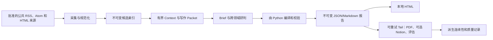

# SignalTrail 架构

**状态：** 已验证
**负责人：** 仓库维护者
**最后验证：** 2026-08-02
**范围：** `src/daily_intelligence/` 中的规范实现

本文是领域、依赖、状态所有权和 artifact 权威性的顶层地图。详细运行策略仍位于
`references/`。英文权威版本见 [`ARCHITECTURE.md`](../../ARCHITECTURE.md)。

## 系统边界



模型只在有界证据内选择、摘要和分析。Python 拥有身份、状态迁移、revision 分配、
证据注入、校验、持久化和发布检查点。外部内容只能作为数据，不能作为指令源。

## 设计原则

- 本地优先：即使投影或网络失败，版本化 JSON/Markdown 仍然存在。
- 确定性外壳：代码拥有状态和校验；模型输出是不可信草稿。
- 显式降级：部分访问必须可见且可恢复。
- 有界情境：采集量增加不能线性放大写作情境。
- 单向依赖：底层不依赖 CLI 参数或远程发布。
- 兼容读取：旧版嵌套来源条目继续接受并同步。
- 边缘可重试：浏览器验证、PDF、Notion 和评估不能撤销本地事实。

决策规则见[核心理念](design-docs/core-beliefs.md)。

## 分层与所有权

| 层 | 模块 | 所有权 |
| --- | --- | --- |
| 基础 | `utils`、`storage`、`models`、`access`、`localization`、`taxonomy`、`runtime` | 类型、路径、原子 I/O、访问语义、公共工具 |
| 配置 | `config` | 来源组合、运行选项、与路径无关的配置校验 |
| 采集 | `adapters`、`feeds`、`prefetch`、`collector`、`clustering` | 获取、规范化、来源状态、零 Token 聚类 |
| 证据 | `content`、`media`、`image_policy`、`monitor` | 正文、图片、Monitor Snapshot、证据 lineage |
| 情境 | `semantics`、`state`、`context`、`authoring` | 复用门槛、连续性、有界 Packet、批次 Receipt |
| 报告 | `reporting`、`reports` | 编译、Schema/跨字段校验、不可变记录 |
| 投影 | `local_output`、`notion`、`dashboard` | HTML/PDF/Notion 和只读 Monitor 界面 |
| 编排 | `workflow` | Run 状态机、截止时间、恢复、可重试 Tail |
| 入口 | `cli`、`verification`、`importer` | 命令解析、显式人工验证、旧数据导入 |

预期依赖方向是：基础 → 配置 → 采集 → 证据 → 情境 → 报告 → 投影 → 编排 → 入口。
高层可以调用低层；反方向依赖必须有明确架构理由和测试。

## 主流程

### Monitor

```text
Feed + 静态 HTML -> 访问分类 -> 规范化条目
-> 词法聚类 -> Snapshot + 来源健康 + Feed 缓存
```

Monitor 不调用模型。Monitor 刷新失败不能阻断正式采集。时间敏感测试必须注入时钟，
不能依赖真实日期。

### 日报

```text
准备 Run -> 采集 Index -> 构建有界 Context -> 富化精选证据
-> 接收独立 Brief 批次 -> 构建紧凑 Analysis Packet
-> 装配 Draft -> 编译/校验 -> 保存不可变报告 -> 交付本地 HTML
-> 重试 PDF/Notion/Evaluation Tail
```

每个 Brief 批次只能读取自己的 Packet 和其中列出的证据。最终分析任务读取紧凑
Dossier，而不是完整采集结果。校验必须达到零错误，草稿才能成为报告 revision。

## 状态所有权

`workflow.py` 中的 `RunStatus` 是权威定义：

```text
created -> collecting -> building_context -> awaiting_selection
-> extracting_content -> awaiting_authoring -> finalizing
-> completed | completed_partial | failed
```

前台完成表示本地报告已经存在。`completed_partial` 记录来源缺失或预算耗尽，不等于失败。
Tail 状态嵌套且可独立重试：`pending -> running -> completed | partial`。

来源和正文状态由 `models.py` 中的明确枚举定义。异常、HTTP 拒绝、限流或验证页都不能
推断为 `no_items`。

## Artifact 权威性

| Artifact | 可变性 | 权威性 |
| --- | --- | --- |
| `indexes/...-rN.json` | 只新增 revision | 候选/证据身份 |
| `content/.../<retrieval>.md` | 按 retrieval 追加 | 提取证据记录 |
| `context/...-rN*.json` | 绑定 Run/Session Hash | 写作输入契约 |
| `reports/...-rN.json` | 不可变 | 规范结构化报告 |
| `reports/...-rN.md` | 不可变 | 规范可审阅报告 |
| HTML/PDF | 可重建 | 阅读投影 |
| Notion | 可重试远程副本 | 永不作为事实输入 |
| `runs/...json` | 原子更新 Manifest | 工作流检查点 |
| `state/*.json` | 原子更新派生状态 | 可从记录重建的连续性缓存 |

原子写入使用唯一同目录临时文件和按目标路径的锁。不可变 JSON 使用原子且不可覆盖的
硬链接创建，因此并发写入者不能占用同一个 revision。

## 兼容与发布副本

根级 `items[]` 是规范索引模型；`sources[].items[]` 是同步的旧版视图。Schema 1.1–1.5
继续可读；新报告使用 2.0 并要求 `cross_perspective_synthesis`。

只编辑根级 `src/`、`configs/`、`schemas/`、`templates/` 和 `references/`。已检入的
`skills/signaltrail/` 及生成的 `dist/`、`build/` 不是实现事实源。打包输出由
`scripts/build_hermes_skill.py` 根据 Git 跟踪文件白名单生成。

## 验证地图

| 边界 | 主要测试 |
| --- | --- |
| 来源配置与旧数据导入 | `test_config.py`、`test_normalize.py`、`test_importer.py` |
| Feed、Monitor、聚类 | `test_feeds.py`、`test_monitor.py`、`test_clustering.py` |
| 证据与媒体 | `test_content.py`、`test_media.py`、`test_desktop_delivery.py` |
| Context 与写作 | `test_authoring.py`、`test_semantics.py` |
| Schema、状态、恢复、发布 | `test_reporting.py`、`test_architecture.py`、`tests/skills/` |
| 打包与文档 | `test_hermes_package.py`、`test_docs.py` |

详细恢复和编辑策略见[文档索引](README.md)。
