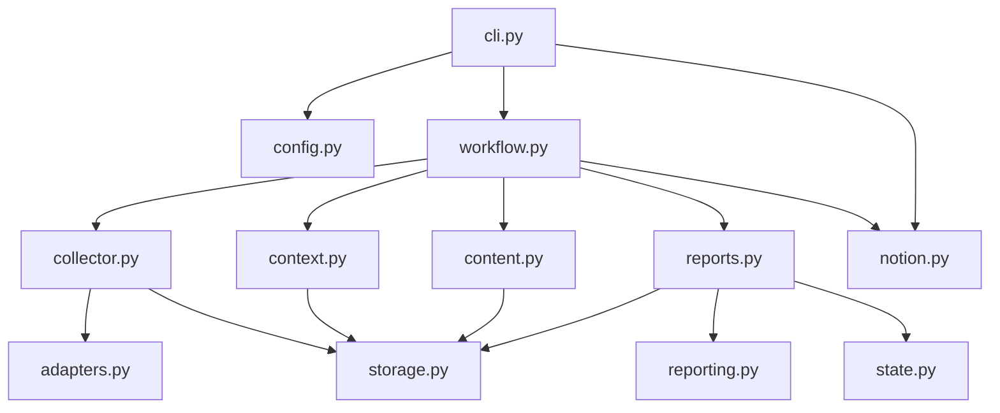

# 总体架构

## 1. 三个运行平面

### Python 控制平面

负责配置解析、浏览器生命周期、来源状态、ID、revision、锁、文件写入、Schema、跨字段验证、Notion 幂等和评估调度。这里的目标是确定性与可测试性。

### Hermes 语义平面

负责翻译、TL;DR、相对重要性、精选事件、三类研判和质量评估。仓库不直接调用任何模型 API；Hermes 通过 `SKILL.md` 获得流程，通过 context JSON 获得候选和约束，通过 `delegate_task` 并行完成三个 brief 批次。

### Artifact 数据平面

负责在阶段之间传递事实：Index、Context、正文、Report、Evaluation 和连续状态。使用文件而不是长会话内存，可在浏览器、Hermes 或 Notion 中断后恢复。



## 2. 模块职责与边界

| 模块 | 允许做什么 | 不应做什么 |
| --- | --- | --- |
| `cli.py` | 参数解析、命令分发、加载 Hermes `.env`、验证队列 UI | 实现核心采集算法或报告规则 |
| `workflow.py` | 状态迁移、锁、阶段组合、失败恢复、评估调度 | 解析站点 DOM、生成 TL;DR |
| `config.py` | 配置 dataclass、路径优先级、动态栏目页 | 抓网页、保存报告 |
| `collector.py` | 打开页面、挑战分类、合并页面、写 index | 针对每个站点堆 DOM 分支 |
| `adapters.py` | 来源协议和过滤、输出统一 `ArticleItem` | 管理 run 状态或 Notion |
| `content.py` | 精选正文并发、内容状态、正文文件 | 决定哪些新闻重要 |
| `context.py` | 压缩候选、历史隔离、批次和计划 | 生成翻译、TL;DR 或研判 |
| `reporting.py` | 编译草稿、注入权威引用、校验跨字段关系 | 替模型补写语义 brief |
| `reports.py` | revision、保存、Markdown 渲染 | 直接抓网页 |
| `notion.py` | schema 映射、block 渲染、幂等发布、反馈读取 | 成为本地事实源 |
| `state.py` | 维护观点/事件/观察项当前视图与历史 | 未经评估写入 schema 1.5 连续性 |

## 3. 依赖方向

建议理解为从“纯数据”逐层走向“流程编排”：

```text
utils / models / taxonomy
          ↓
config / storage
          ↓
adapters → collector → content
          ↓             ↓
        index ───────→ context
          ↓             ↓
      reporting ← model draft
          ↓
       reports → state
          ↓
        notion
          ↓
       workflow
          ↓
          cli
```

这不是严格无环的教科书分层，例如 `workflow.py` 同时组合 `context`、`content`、`reports` 与 `notion`；但底层模块不应反向调用 CLI 或 Hermes。

## 4. 为什么只有一个运行 CLI

仓库只保留 `daily-intel` 一个入口，`scripts/install.ps1` 和 `scripts/install.sh` 只安装，不参与日报运行。过去把采集、修复、发布拆成多个独立脚本容易造成：

- 环境变量加载方式不同；
- DATA_DIR 不一致；
- 相同状态在不同脚本里重复实现；
- schema 修复顺序不同；
- Windows/Bash 行为分叉。

现在所有子命令都经过 `cli.main()`：先加载 Hermes `.env`，再加载同一套 sources config、解析同一 DATA_DIR，然后进入模块函数。所谓“跨脚本调用”在当前实现中主要是**单 CLI 内的跨模块调用**，而不是脚本互相启动。

唯一例外是发布后评估调度：`workflow.schedule_independent_evaluation()` 通过 `subprocess.run()` 调用 Hermes CLI 创建独立 Cron 任务，这是刻意隔离模型上下文，而不是复用当前生成 Agent。

## 5. 控制面可变、数据面不可变

```text
runs/YYYY-MM-DD/<edition>.json   ← 可变：记录当前阶段与下一步
indexes/*-rN.json                ← 不可变：某次采集/增强事实快照
context/*-rN.json                ← 不可变：某次写作输入快照
reports/*-rN.json                ← 不可变：已验证日报
evaluations/*-rN.json            ← 不可变：对特定报告的评估
state/*.json                     ← 可变：当前连续性视图
state/history/*-rN.json          ← 不可变：状态历史
```

控制面回答“现在进行到哪一步”，数据面回答“当时看到了什么、写了什么”。run manifest 可以被更新；历史 artifact 用 `write_immutable_json()` 拒绝覆盖。

## 6. 两阶段阅读

第一阶段采集栏目页的标题、链接、摘要和发布时间，足够用于覆盖层。第二阶段只对最多 12 个精选 ID 打开文章正文。

收益：

- 大多数新闻不消耗正文读取时间；
- 减少恶意网页内容进入 Agent 上下文；
- 研判可以集中在高价值事件；
- 同一正文文件可被后续流程按路径读取，而非重复塞进 context。

代价是增加一个 `awaiting_selection → extracting_content → awaiting_authoring` checkpoint，因此需要 run 状态机。

## 7. 生成与评估角色分离

生成 Agent 需要综合上下文并快速交付；评估 Agent 只应看到不可变结果。发布流程因此是：

```text
生成 → Python 验证 → 保存 → 发布 → 返回成功
                              └→ 异步创建独立评估任务
```

评估任务绑定 `report_id` 和内容 SHA-256。即使评估失败，日报仍然有效；即使同一天后来生成新 revision，旧任务也无法误评新内容。

## 8. 发布适配器边界

Notion publisher 只消费已经保存并通过验证的 report JSON。它不直接读取网页，不访问 Hermes context，也不在发布时修正语义。这样未来替换为静态网站、邮件或其他知识库时，只需新增投影层，不改采集和报告契约。
