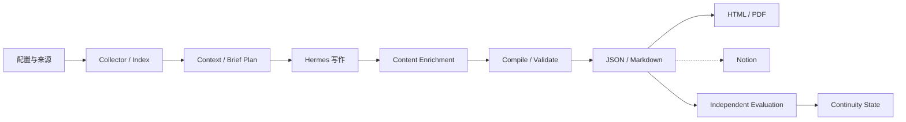

# 总体架构

## 运行分层



| 层 | 负责内容 |
| --- | --- |
| Python 控制层 | 采集、状态、预算、Revision、编译、校验、持久化和发布 |
| Hermes 语义层 | 标题翻译、TL;DR、精选事件选择和研判 |
| Artifact 层 | Index、Context、Report、Evaluation 和连续状态 |

Python 包不直接调用模型 API。Hermes 根据 `SKILL.md` 读取 Context、生成草稿，再调用 CLI 完成确定性处理。

## 模块职责

| 模块 | 输入 | 输出 |
| --- | --- | --- |
| `config.py` | YAML、环境变量、CLI 参数 | `AppConfig` 和运行路径 |
| `prefetch.py` | 公开索引 URL | 无脚本 HTTP 预取结果 |
| `adapters.py` | 页面行或来源 API | `ArticleItem` 列表 |
| `collector.py` | 来源配置和预取结果 | 不可变 Index |
| `verification.py` | 待验证来源 | 验证队列和合并后的 Index |
| `content.py` | Index 和选中 ID | 正文文件和新 Index Revision |
| `context.py` | Index、历史报告、状态 | Context、`brief_plan`、批次 |
| `workflow.py` | 阶段命令 | Run manifest 和阶段转换 |
| `reporting.py` | 模型草稿和 Index | 归一化报告、错误与警告 |
| `reports.py` | 已校验报告 | JSON、Markdown、连续状态 |
| `local_output.py` | 报告和 Evaluation | HTML、PDF、日报索引 |
| `notion.py` | 报告、Notion schema | 页面块、发布登记、反馈 |

## 依赖方向

底层模块不依赖流程编排：

```text
utils / storage / taxonomy / models
                ↓
config / adapters / prefetch
                ↓
collector / content / context / reporting
                ↓
reports / local_output / notion
                ↓
workflow
                ↓
cli
```

允许的例外应有明确测试。避免从底层模块导入 `cli.py` 或 `workflow.py`。

## Artifact 边界

- Index 保存采集事实和来源状态。
- Context 只保存模型完成当前阶段所需的压缩信息。
- Report 保存读者可见内容和可验证引用。
- Evaluation 独立保存，并通过报告 ID 与 Hash 绑定。
- HTML、PDF 和 Notion 可以重新生成，不作为事实输入。

## 写入边界

- 不可变文件：带 Revision 的 Index、Report、Evaluation 和历史状态。
- 可变指针：`latest.json`、Run manifest、发布登记和当前连续状态。
- 可变文件必须原子写入；并发 edition 使用排他锁。

## 发布边界

本地交付先于远程发布。Notion 适配器只能读取已校验报告，不得修改报告内容或回写语义字段。失败状态写入发布登记，供后续重试。
