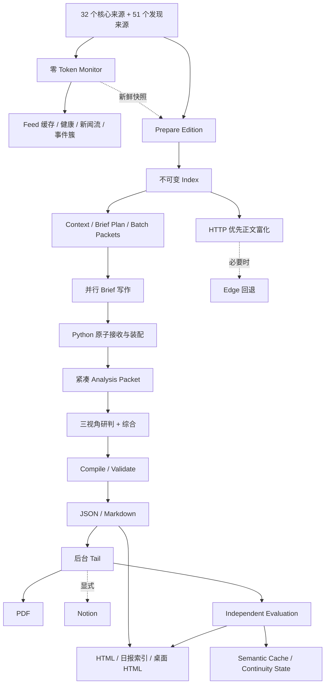

# 总体架构

## 运行分层


```mermaid
flowchart TD
    C["32 个核心来源 + 51 个发现来源"] --> M["零 Token Monitor"]
    M --> F["Feed 缓存 / 健康 / 新闻流 / 事件簇"]
    M -. "新鲜快照" .-> P["Prepare Edition"]
    C --> P
    P --> I["不可变 Index"]
    I --> X["Context / Brief Plan / Batch Packets"]
    X --> B["并行 Brief 写作"]
    I --> E["HTTP 优先正文富化"]
    E -. "必要时" .-> G["Edge 回退"]
    B --> A["Python 原子接收与装配"]
    A --> Q["紧凑 Analysis Packet"]
    Q --> H["三视角研判 + 综合"]
    H --> V["Compile / Validate"]
    V --> T["JSON / Markdown"]
    T --> L["HTML / 日报索引 / 桌面 HTML"]
    T --> R["后台 Tail"]
    R --> D["PDF"]
    R -. "显式" .-> N["Notion"]
    R --> Z["Independent Evaluation"]
    Z --> S["Semantic Cache / Continuity State"]
    Z --> L
```

| 层 | 责任 |
| --- | --- |
| 监控层 | Feed、静态 HTML、缓存、健康、聚类；零模型 Token |
| Python 控制层 | 状态、预算、并发、Revision、编译、校验、持久化和发布 |
| Hermes 语义层 | 按 run 的 `zh-CN` / `en` 输出标题翻译、TL;DR、精选事件、三视角研判和综合 |
| Artifact 层 | Index、Context、Authoring Session、Report、Evaluation 和连续状态 |
| 投影层 | HTML、桌面 HTML、PDF、本地索引和 Notion |

Python 包不直接调用模型供应商 API。Hermes 按 `SKILL.md` 读取有界 Artifact，写入指定结果路径，再调用 CLI 进入下一确定性阶段。

## 模块职责

### 采集与监控

| 模块 | 责任 |
| --- | --- |
| `feeds.py` | Feed 发现、RSS/Atom 解析、条件缓存和刷新窗口 |
| `monitor.py` | 83 来源监控编排、历史合并、健康和快照 |
| `clustering.py` | 确定性跨来源词法聚类、阶段与重要性 |
| `dashboard.py` | 只读本地情报台和可选后台刷新 |
| `prefetch.py` | 正式采集前的无脚本 HTML 并发预取 |
| `adapters.py` | 通用/专用来源解析和 URL 过滤 |
| `collector.py` | 正式来源结果合并和不可变 Index |
| `verification.py` | 显式人工验证队列和验证结果合并 |

### 内容与写作

| 模块 | 责任 |
| --- | --- |
| `content.py` | HTTP 优先正文提取、Edge 回退和 Index Revision |
| `media.py` | 图片安全校验、缓存、并发下载和报告绑定 |
| `context.py` | 历史压缩、候选排序、Brief Plan 和批次包 |
| `authoring.py` | 写作 Session、批次验收、指标、分析包和 schema 2.0 草稿装配 |
| `localization.py` | 两种输出语言、译题字段和确定性文本语言检查 |

### 报告与发布

| 模块 | 责任 |
| --- | --- |
| `reporting.py` | 编译、归一化、Schema 与证据校验 |
| `reports.py` | Report/Evaluation 持久化和 Markdown |
| `local_output.py` | HTML、桌面 HTML、PDF 和日报索引 |
| `notion.py` | Schema 匹配、图片上传、断点续传、反馈同步 |
| `semantics.py` | 证据指纹与受评估控制的 Brief 复用 |
| `state.py` | 事件、研判和观察项连续状态 |

### 运行基础

| 模块 | 责任 |
| --- | --- |
| `config.py` | 类型化配置、资源目录和环境解析 |
| `runtime.py` | 唯一数据根绑定和跨根拒绝 |
| `storage.py` | Revision、不可变写入、原子写和排他锁 |
| `workflow.py` | Edition、Authoring、Finalize 和 Tail 状态转换 |
| `cli.py` | 参数解析、依赖注入和命令分发 |

## 依赖方向

```text
utils / storage / taxonomy / models / access
                     ↓
config / feeds / adapters / clustering
                     ↓
monitor / prefetch / collector / content / media
                     ↓
context / authoring / reporting
                     ↓
reports / local_output / notion / semantics / state
                     ↓
workflow
                     ↓
cli
```

底层模块不得导入 `cli.py`。从底层导入 `workflow.py` 也应视为架构错误。必要的跨层协作通过类型化参数和 Artifact 路径完成。

## 数据与信任边界

- 来源配置是受信代码/配置。
- 网页、Feed、API 响应、正文、图片和模型输出都是不可信数据。
- Index 保存已观察的采集事实，不保存模型推断。
- Context 是面向当前阶段的有界数据包，不是长期事实源。
- Authoring Packet 是子任务唯一允许读取的候选边界。
- Report 只在编译和校验通过后成为事实源。
- Evaluation 是独立意见，不回写不可变 Report。

## Artifact 边界

| Artifact | 可变性 | 用途 |
| --- | --- | --- |
| `indexes/...-rN.json` | 不可变 | 采集事实与访问状态 |
| `context/...-rN.json` | 不可变 Revision | 当前写作上下文 |
| Authoring Session / Receipt | Session 可更新、Receipt 不可变 | 批次进度与指标 |
| `reports/...-rN.json/.md` | 不可变 | 本地事实源 |
| `evaluations/...-rN.json` | 不可变 | 独立质量意见 |
| `latest-*.json`、Run、健康、发布登记 | 可变 | 指针、运行和恢复状态 |
| HTML/PDF/Notion | 可重建 | 阅读与远程投影 |

可变 JSON 和文本必须原子写入。相同日期与 edition 的关键阶段通过锁文件串行化。

## 前台与后台发布边界

`finalize-edition --defer-tail` 在 JSON、Markdown、HTML、本地索引和桌面 HTML 就绪后返回。Run 此时已经是 `completed` 或 `completed_partial`，但 `tail.status` 仍可能为 `pending`。

`complete-edition-tail` 幂等完成：

1. PDF；
2. 可选 Notion；
3. 独立 Evaluation 调度。

尾部失败只产生 `partial` 与可重试错误，不撤回本地报告。Notion 和桌面目录都不能反向成为报告事实输入。
