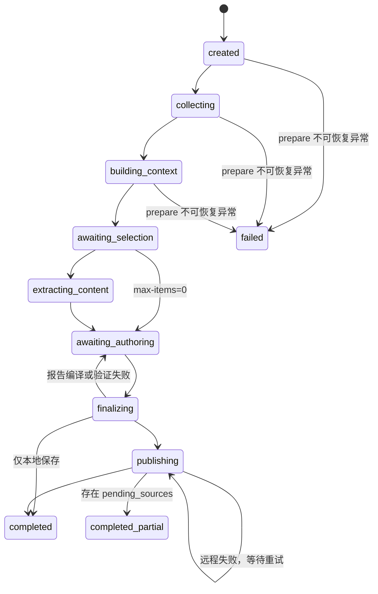

# 数据与状态模型

## 1. 配置实体

### `SourceConfig`

由 `configs/sources.yaml` 解析为 dataclass，关键字段包括：

| 字段 | 含义 |
| --- | --- |
| `id` / `name` | 稳定机器 ID 与读者名称 |
| `url` / `explore_urls` | 主栏目与静态扩展栏目 |
| `mode` / `adapter` | 选择哪个采集 adapter；`adapter` 优先于 `mode` |
| `module` / `category` | 进入七个固定栏目的位置 |
| `role` | `discovery`、`evidence` 或 `primary` 的证据角色 |
| `include_domains` | 允许域名，也是动态栏目页的安全边界 |
| `article_patterns` | 必须命中的文章 URL 正则 |
| `exclude_patterns` | 必须排除的导航、作者、视频等 URL |
| `exclude_title_patterns` | 标题级噪音过滤 |
| `content_selectors` | 正文提取选择器优先序 |
| `max_items` | 索引最多保留候选数 |
| `report_target` / `report_max` | 日报目标条数与上限，后者不能超过全局 15 |

### `BrowserConfig` 与 `BudgetConfig`

`BrowserConfig` 控制 profile 环境变量名、浏览器 channel、正文并发、导航超时和默认等待；`BudgetConfig` 控制 600 秒预算、Agent token 契约、context 每来源候选数、日报每来源上限和正文硬上限。

## 2. 采集实体

### `ArticleItem`

```json
{
  "item_id": "bbc_world-a1b2c3d4e5f6",
  "source_id": "bbc_world",
  "source_name": "BBC",
  "title": "Original headline",
  "url": "https://www.bbc.com/news/articles/...",
  "canonical_url": "https://bbc.com/news/articles/...",
  "discovered_at": "2026-07-17T06:02:10+08:00",
  "published_at": "2026-07-17",
  "module": "information",
  "category": "international",
  "content_status": "not_fetched",
  "description": "Public description when available",
  "metadata": {
    "role": "evidence",
    "source_rank": 1
  }
}
```

`canonical_url` 会统一 HTTP(S) 为 HTTPS、去掉 `www.`、折叠重复斜杠、删除末尾斜杠、移除 fragment 和跟踪查询参数。`item_id` 是 `source_id|canonical_url` 的 SHA-256 前 12 位，因此同来源同 canonical URL 在不同日期仍稳定。

### `SourceResult`

表示一个逻辑来源的采集结果。一个来源可以访问多个栏目页，`page_results[]` 保存每个页面状态，聚合后的 `items[]` 保存轮询合并候选。

来源状态：

| 状态 | 严格含义 |
| --- | --- |
| `success` | 有候选，且页面均为成功或正常无条目 |
| `partial` | 有候选，但至少一个栏目失败、需验证或限流 |
| `verification_required` | 没有候选且遇到 401/403/CAPTCHA/安全检查 |
| `rate_limited` | 没有候选且遇到 429 或明确临时限制文本 |
| `failed` | HTTP、导航、解析或设施错误 |
| `no_items` | 页面正常可读，但过滤后确实没有文章链接 |

`failed`、`verification_required` 和 `rate_limited` 绝不能改写成 `no_items`。

## 3. Index

Index 是某次采集事实快照，schema 当前为 1.1：

```text
index
├─ index_id / date / edition / revision
├─ timezone / generated_at / browser_profile
├─ source_policies
├─ sources[]
│  ├─ status / error / page_results[]
│  └─ items[]              旧兼容嵌套视图
└─ items[]                 规范根级视图
```

根级 `items[]` 是后续 context、正文和报告编译的权威输入。为了兼容旧工具，`sources[].items[]` 仍被保留；`content.synchronize_nested_items()` 会在 enrich 后把根级最新状态复制回嵌套视图，防止两套状态不一致。

## 4. 正文状态

| `content_status` | 映射到报告 `access` | 含义 |
| --- | --- | --- |
| `not_fetched` | `metadata_only` | 尚未按需读取正文 |
| `metadata_only` | `metadata_only` | 页面可读，但可见正文不足 500 字符 |
| `partial` | `partial` | 可见正文 500—1499 字符 |
| `full_text` | `full_text` | 可见正文至少 1500 字符 |
| `verification_required` | `verification_required` | 正文页需要验证 |
| `failed` | `metadata_only` | 抓取失败；报告不能伪称读过正文 |

报告的 access 枚举与索引状态不同，统一映射由 `reporting.CONTENT_STATUS_TO_ACCESS` 完成，不要求 Agent 手工猜测。

## 5. Context

Context 是给 Hermes 的压缩写作输入，不嵌入完整正文：

| 字段 | 用途 |
| --- | --- |
| `candidate_sources[]` | 来源状态、错误、目标与上限 |
| `candidate_items[]` | 每来源压缩后的候选字段 |
| `brief_authoring_batches[]` | 最多三个负载平衡批次 |
| `brief_plan[]` | 每来源 section、target_count 与默认 item ID |
| `continuity_reports[]` | 最近最多五份经过评估隔离的历史摘要 |
| `active_theses[]` | 可复用的活跃判断 |
| `active_watchlist[]` | 后续观察信号 |
| `open_predictions[]` | 预留的预测状态 |
| `user_feedback[]` | 从 Notion 同步的人类评分和意见 |
| `*_rule` | 内容加载、写作、连续性和选择边界 |
| `budget` | 当前运行预算与正文并发限制 |

正文只以 `content_path` 指针出现。Hermes 仅在为精选事件写 TL;DR 或研判时读取对应文件。

## 6. Report schema 1.5

### Brief

模型最小输入通常是：

```json
{
  "item_id": "bbc_world-a1b2c3d4e5f6",
  "title": "Original headline",
  "title_zh": "自然中文翻译",
  "tldr": "基于可观察内容的中文事实摘要。",
  "importance": 78,
  "status": "NEW"
}
```

`source_ref`、`primary_source`、`source_rank` 和 `source_rank_label` 由 Python 从 index 注入。原文标题最终以索引为准，Agent 不能改写来源标题。

### Featured Event

精选 Event 比 brief 多出：`event_id`、`source_refs[]`、`confidence`、`importance_breakdown`、`importance_reason`、`evidence_notes`、`tags`。它必须能在同 section 的 brief 中找到对应 `featured_event_id`。

状态枚举：

| 状态 | 用途 |
| --- | --- |
| `NEW` | 今日/昨日首次出现且未复用历史事件或来源 item |
| `UPD` | 已知事件出现新事实 |
| `CONF` | 原判断得到更强确认 |
| `REV` | 原事实或判断需要修正 |
| `WATCH` | 仍值得关注，但不是当日新事件或证据不足 |
| `CLOSED` | 事件或观察项已结束 |

### Analysis

包含 claim、domain、confidence、evidence_event_ids、facts、reasoning、counter_evidence、scenarios、implications、actions、watch_signals、invalidation_signals，以及 schema 1.5 要求的 narrative、historical_context、dialectical_analysis、stakeholder_positions、perspectives 和 assessment_types。

## 7. Run 状态机

`RunStatus` 只有以下值；评估状态是 run 内的独立字段，不是 RunStatus：



`completed` 与 `completed_partial` 都是合法终态。后者表示有失败、验证或限流来源，不表示报告本身验证失败。

## 8. 连续状态

独立评估完成后，`state.py` 更新：

- `theses.json`：按 `analysis_id` 保存当前 claim、置信度、状态和历史；
- `watchlist.json`：`WATCH-<hash>` 由 `analysis_id|signal` 确定性生成；
- `events.json`：按 event ID 保存当前事件视图和出现过的 report IDs；
- `history/<name>/<date>-rN.json`：每次更新的不可变快照。

schema 1.5 主报告发布时不会立即污染连续状态。只有独立评估 artifact 通过 `save_evaluation()` 后，才根据 `exclude_from_continuity` 选择性写入。

## 9. Evaluation

评估包含九个唯一维度，每项 1—5 分，总分必须等于分项之和；还包含主要缺陷、证据不足、改进建议、连续性决策和排除字段。

评估必须满足：

- `evaluator_role == "independent"`；
- `evaluated_report_id` 等于不可变报告 ID；
- `evaluated_content_hash` 等于报告内容 hash；
- `continuity_decision` 为 `accept`、`selective` 或 `reject`；
- `reject` 必须排除 `all`。

Python 还施加确定性质量底线：总分不高于 22 或至少三个关键维度不高于 2 时强制全部拒绝；总分低于 32 或存在低分关键维度时，不能直接 accept。
