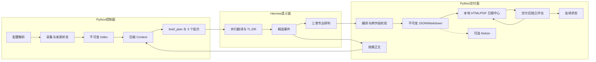

# Daily Intelligence Repo Wiki

这套 Wiki 解释 Daily Intelligence v1.0.0 为什么这样设计、代码实际如何运行，以及修改一个配置、算法或字段时会跨越哪些模块。

Daily Intelligence 是面向 Hermes Agent 的双时段中文情报生产系统：06:00 建立晨间基线，18:00 读取同日晨报和日间新增证据，形成修订后的晚间版。它不是单纯网页摘要器，而是一条包含采集、证据分级、语义写作、确定性编译、发布、独立评估和历史连续性的流水线。

> 核心原则：Hermes 负责必须理解语义的工作；Python 负责必须稳定、可重复、可验证和可恢复的机制。

## 先理解三个边界

1. **仓库不直接调用模型 API。** Python 生成 context 和写作计划；Hermes 读取 `SKILL.md` 后调用自己的模型与 `delegate_task`。因此“翻译/TL;DR 算法”一半是结构化输入和验证器，一半是 Hermes 写作契约。
2. **本地 artifact 是事实源。** JSON/Markdown 不可变；HTML/PDF 是默认可刷新阅读投影；Notion 只是可选远程投影。没有 Notion 也能完整交付、评估和归档。
3. **覆盖层不等于研判层。** `briefs[]` 尽量覆盖来源候选；`items[]` 只放少量精选事件。正文与重型分析只服务于精选事件，避免新闻越多、成本线性爆炸。

## 系统全景

## 阅读路线

| 顺序 | 页面 | 解决的问题 |
| ---: | --- | --- |
| 1 | [产品目标与边界](01-产品目标与边界) | 日报要解决什么，不解决什么 |
| 2 | [总体架构](02-总体架构) | 系统分层、模块职责和依赖方向 |
| 3 | [数据与状态模型](03-数据与状态模型) | Index、Context、Report、Evaluation 与状态如何关联 |
| 4 | [端到端流程](04-端到端流程) | 一次晨报/晚报真实经过哪些步骤和文件 |
| 5 | [设计标准](05-设计标准) | 为什么选择两层报告、不可变 revision 和角色分离 |
| 6 | [可靠性与安全](06-可靠性与安全) | 失败、重试、并发、凭证和网页不可信边界 |
| 7 | [扩展开发](07-扩展开发) | 如何添加来源、adapter、字段、分类和 publisher |
| 8 | [测试、运维与演进](08-测试运维与演进) | 测试基线、值班检查、发布清单和故障定位 |
| 9 | [依赖、配置与注入](09-依赖配置与注入) | 依赖作用、环境/来源/Agent/Notion 注入 |
| 10 | [核心算法与跨模块调用](10-核心算法与跨模块调用) | URL、过滤、批次、正文并发、编译、验证的代码实现 |

## 代码入口速查

| 文件 | 主要职责 |
| --- | --- |
| `src/daily_intelligence/cli.py` | 唯一 CLI 入口、参数解析、Hermes `.env` 加载和命令分发 |
| `workflow.py` | edition 状态机、锁、prepare/enrich/finalize、评估调度 |
| `config.py` / `runtime.py` | YAML、路径优先级、唯一数据根绑定与跨根守卫 |
| `collector.py` / `prefetch.py` | 有界 HTTP 预取、Edge 回退、多栏目合并、索引 revision |
| `verification.py` | Edge 待验证队列、标签监听、成功页面采集与 index adoption |
| `adapters.py` | 来源协议、链接过滤、特定站点/API 提取 |
| `content.py` | 精选正文并行读取、内容状态、正文 Markdown |
| `context.py` / `semantics.py` | 候选压缩、评估门控复用、三批次与 `brief_plan` |
| `reporting.py` | 模型草稿编译、证据注入、Schema 与语义验证 |
| `reports.py` | 不可变报告/评估保存与投影编排 |
| `local_output.py` | 安全 HTML、日报中心、Edge/ReportLab PDF 与评估后刷新 |
| `notion.py` | Data Source schema 匹配、排版、发布进度、反馈同步 |
| `state.py` | 观点、事件、观察项的当前视图与不可变历史 |
| `storage.py` | revision、原子写、不可变写、排他锁 |

## 当前实现与预算说明

- 通用公开索引页先以无脚本 HTTP 全局 8、同域 2 并发；只有登录、挑战、JS 空页和专用 adapter 回退到单个持久化 Edge context。
- 正文 enrich 才使用异步并发，默认全局 3、同域 1、每版硬上限 12。
- 语义缓存只有在内容指纹未变化且交付后独立评估通过门槛时才复用；它不缓存研判。
- `max_runtime_seconds=600` 会生成 deadline，并在 enrich 阶段停止新增正文、在结果中记录超时；它不是强制杀掉正在导航的操作系统级 watchdog。
- `max_agent_tokens=10000000` 是交给 Hermes 的预算契约和 run 元数据；本仓库不直接读取模型供应商 token 计数。
- 本地交付成功后独立评估按 2 分钟间隔最多尝试 3 次；主日报不会等待评估，Notion 不是前置条件。

## 文档和代码发生冲突时

优先级为：

1. `schemas/report.schema.json` 与 Python 验证器；
2. 当前代码与测试；
3. `SKILL.md` 和 `templates/report-contract.md`；
4. `references/`；
5. Wiki 与 README。

如果行为与本文不一致，应先用测试确认代码事实，再同步修正文档。Wiki 解释设计，不替代机器契约。
